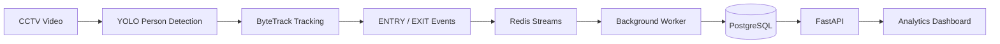

# Retail Store Analytics Platform

This project is a complete analytics platform for physical retail stores. It uses computer vision to track customer movement, providing valuable insights like peak hours, customer traffic funnels, and store layout effectiveness.

**Business Goal:** To give physical stores the same kind of powerful analytics that e-commerce websites have, helping them optimize operations and improve customer experience.


## What it Does

*   **Tracks Customer Flow:** Analyzes video from store cameras to count how many people enter and exit.
*   **Calculates Key Metrics:** Provides real-time data on store traffic, average visit duration, and occupancy.
*   **Visualizes Traffic Hotspots:** Generates heatmaps to show which areas of the store are most popular.
*   **Identifies Conversion Funnels:** Measures how many people pass by versus how many enter, helping to gauge the effectiveness of window displays.
*   **Detects Anomalies:** Automatically flags unusual traffic patterns that might indicate an issue or opportunity.

## Getting Started

The entire application is containerized and can be run with a single command.

**Prerequisites:**
*   Docker
*   Docker Compose

**Running the Application:**

1.  **Clone the repository:**
    ```bash
    git clone <repository-url>
    cd <repository-name>
    ```

2.  **Set up environment variables:**
    ```bash
    cp .env.example .env
    ```
    *(You can modify the `.env` file if needed, but the defaults will work out-of-the-box.)*

3.  **Build and run the services:**
    ```bash
    docker-compose up --build
    ```

This command will start the FastAPI web server, the background worker, the Redis message queue, and the PostgreSQL database.

*   **API:** The API will be available at `http://localhost:8000/docs`.
*   **Running the CV Pipeline:** To process a sample video, run the following command in a separate terminal:
    ```bash
    docker-compose run --rm cv-pipeline --video ./samples/sample.mp4 --store-id default --camera-id 1
    ```

## Project Structure

The project is organized into clear, distinct modules:

*   `/app`: Contains the core application logic, including the FastAPI server, database models, and business services.
*   `/cv`: Holds the computer vision pipeline responsible for video processing and event generation.
*   `/workers`: Contains the background worker that processes data from the CV pipeline.
*   `/tests`: Includes a suite of tests to ensure the system is working correctly.
*   `/configs`: Store-specific configurations, like camera locations and line coordinates.

For a deeper dive into the architecture and technology choices, please see [DESIGN.md](DESIGN.md) and [CHOICES.md](CHOICES.md).

## System Flow

