# Retail Store Analytics Platform

A computer vision powered retail analytics platform that transforms CCTV footage into actionable business insights. The system detects customer entry and exit events, tracks customer movement, generates analytics, and persists customer sessions using an event-driven architecture.

## Project Overview

Physical retail stores often lack the detailed customer analytics available in e-commerce platforms. This project bridges that gap by using computer vision and event processing to provide:

* Customer entry and exit tracking
* Real-time occupancy estimation
* Customer session analytics
* Traffic pattern analysis
* Event-driven retail insights
* Historical analytics through APIs

## Architecture


### System Flow

```mermaid
flowchart LR

    Video[CCTV Video / MP4]
    YOLO[YOLOv8 Person Detection]
    Track[ByteTrack Multi Object Tracking]
    Event[Entry / Exit Event Generation]
    Redis[Redis Streams]
    Worker[Background Worker]
    DB[(PostgreSQL)]
    API[FastAPI]
    Dashboard[Analytics Consumers]

    Video --> YOLO
    YOLO --> Track
    Track --> Event
    Event --> Redis
    Redis --> Worker
    Worker --> DB
    DB --> API
    API --> Dashboard
```



## Technology Stack

### Computer Vision

* YOLOv8
* ByteTrack
* OpenCV

### Backend

* FastAPI
* Python 3.12
* SQLAlchemy
* Alembic

### Infrastructure

* PostgreSQL
* Redis Streams
* Docker
* Docker Compose

### Testing

* Pytest

## Key Features

### Customer Flow Analytics

* Detect customer entries
* Detect customer exits
* Track occupancy changes

### Event Driven Architecture

* Generate entry and exit events
* Publish events to Redis Streams
* Process events asynchronously

### Session Analytics

* Customer session creation
* Session closure on exit
* Visit duration tracking

### Analytics APIs

* Traffic analytics
* Occupancy analytics
* Session analytics
* Historical metrics

## Project Structure

```text
app/
├── api/
├── core/
├── cv/
├── db/
├── domain/
├── infrastructure/
├── services/
├── workers/

configs/
tests/
docker-compose.yml
```

## Getting Started

### Prerequisites

* Docker
* Docker Compose

### Run Application

```bash
cp .env.example .env
docker compose up --build
```

### API Documentation

```text
http://localhost:8000/docs
```

## Running the CV Pipeline

```bash
docker compose exec worker \
python -m app.cv.run_pipeline \
--video "samples/CAM 5.mp4" \
--store default \
--camera entry
```

## End-to-End Validation

The system was validated using real CCTV footage.

### Test Scenario

Input Video:

* CAM5.mp4

Pipeline:

Video
→ YOLOv8 Detection
→ ByteTrack Tracking
→ Line Crossing
→ Redis Streams
→ Worker Processing
→ PostgreSQL Persistence

### Validation Results

| Metric           | Result |
| ---------------- | ------ |
| Events Generated | 10     |
| Entry Events     | 6      |
| Exit Events      | 4      |
| Sessions Created | 5      |
| Active Sessions  | 4      |
| Closed Sessions  | 1      |

### Database Verification

Events:

```text
ENTRY = 6
EXIT = 4
```

Sessions:

```text
active = 4
closed = 1
```

### Verified Components

✓ YOLOv8 Detection

✓ ByteTrack Tracking

✓ Line Crossing Event Generation

✓ Redis Stream Publishing

✓ Worker Consumption

✓ PostgreSQL Persistence

✓ Session Management

## Demo

Repository:

* GitHub Repository

Video:

* Project Demonstration Video

API:

* Swagger Documentation

## Future Improvements

* Heatmap generation
* Multi-camera tracking
* Re-identification across cameras
* Dwell time analytics
* Real-time dashboard
* Cloud deployment

## License

Educational / Portfolio Project
